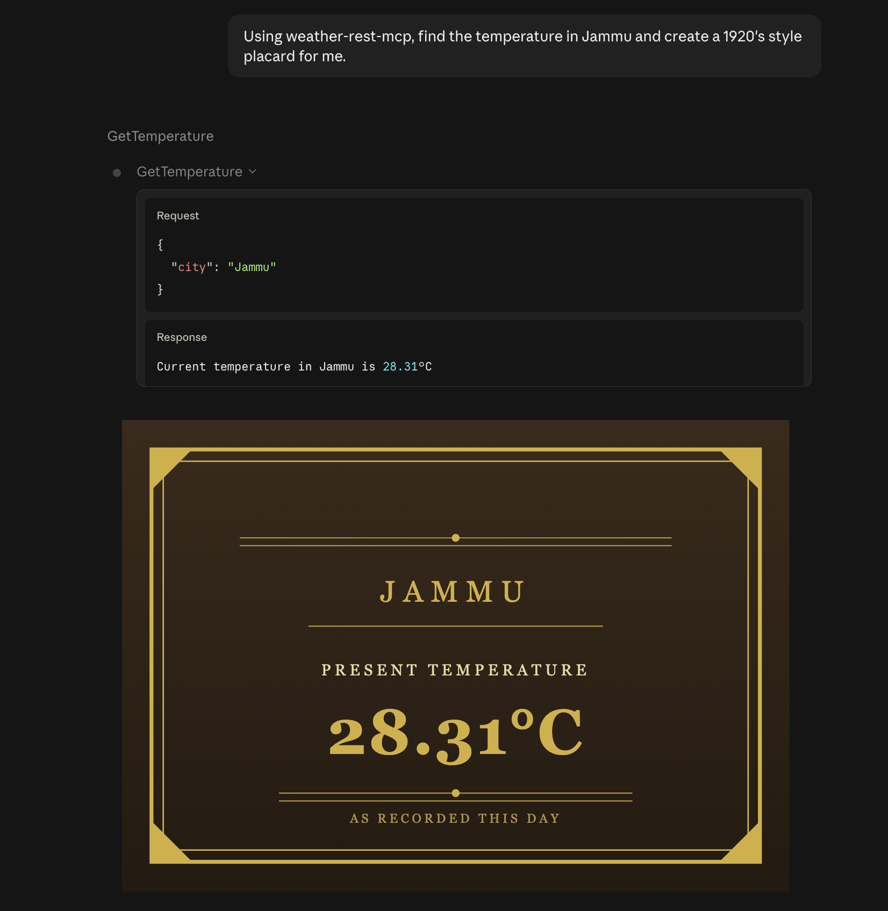

Welcome to my humble API! I have an endpoint that shows you the weather conditions in your town.


Coming soon: MCP tools and AI client functionality for knowing the weather.

UPDATE! MCP Tool functionality is now live! Look for the @McpTools annotated method.
Example:



The following Readme has been generated using an AI tool. I have added some personal tidbits for help.
## Prerequisites
Before you start, make sure you have:
- **Java 25** (matches this project's toolchain)
- **Docker Desktop** — installed and running. This project uses Docker Compose to run local infrastructure (Keycloak, and any other services defined in `docker-compose.yaml`) so you don't need to install those directly on your machine.
- **Git**
- **Postman** (optional, but recommended) — a Postman collection/environment is included under `.postman/` and `postman/` to make testing easier.

You do **not** need Gradle installed separately — this repo includes the Gradle wrapper (`gradlew` / `gradlew.bat`), which downloads the correct Gradle version automatically.

## 1. Clone the repository
```bash
git clone git@github.com:anirmasharudh/payments-and-weather.git
cd payments-and-weather
```
(If you haven't set up SSH with GitHub, use the HTTPS URL instead — see GitHub's docs on Personal Access Tokens for authentication.)

## 2. Start local infrastructure with Docker
This project uses Docker Compose to run supporting services locally (currently: Keycloak for authentication; check `docker-compose.yaml` for the full/current list).
```bash
docker compose up -d
```
Verify everything started correctly:
```bash
docker compose ps
```
All services should show as `running` (or `healthy` if a healthcheck is defined).
> **First-time run note:** Docker needs to download each image the first time — this can take a couple of minutes depending on your connection. Subsequent runs will be much faster.

## 3. Set up Keycloak (authentication)
The app validates requests using JWTs issued by Keycloak. On first run, Keycloak starts empty — you need to configure a realm, client, and test user once.
1. Open the Keycloak admin console: **http://localhost:9000**
2. Log in with the bootstrap admin credentials (see `docker-compose.yaml` — currently `admin` / `admin` for local dev).
3. **Create a realm** — name it something like `payments-dev` (recommended over using the default `master` realm).
4. **Create a client**:
   - Client ID: `payments-postman` (or any name you prefer)
   - Client authentication: **On**
   - Under **Advanced/Settings**, enable **Direct access grants** (needed to request tokens directly via username/password, which is the simplest flow for local testing).
   - Save, then go to the **Credentials** tab and copy the **Client secret** — you'll need this to request tokens.
5. **Create a test user**:
   - Users → Add user → set a username (e.g. `payments-user`) → Save.
   - Go to the **Credentials** tab for that user → set a password → toggle **Temporary** off.
6. *(Optional, if your endpoints check roles)* Assign realm roles to the test user under **Users → [user] → Role mapping**, and ensure a `roles` claim is included in the token (client scope mapper) — the app's `JwtAuthenticationFilter` reads a `roles` claim from the JWT.

## 4. Configure application properties
Copy the example properties file and fill in your own values:
```bash
cp src/main/resources/application.properties.example src/main/resources/application.properties
```
Then edit `application.properties` and set:
```properties
jwt.jwk-set-uri=http://localhost:9000/realms/payments-dev/protocol/openid-connect/certs
openweathermap.api-key=<your-openweathermap-api-key>
```
- **JWT JWKS URI** — must match the realm name you created in Step 3.
- **OpenWeatherMap API key** — sign up for a free key at [openweathermap.org](https://openweathermap.org/api). New keys can take up to ~2 hours to activate.

## 5. Run the application
```bash
./gradlew bootRun
```
Or, from IntelliJ: run the `PaymentsApplication` main class directly.
The app starts on **http://localhost:8080** by default.

## 6. Get an auth token and call the API
**Request a token from Keycloak:**
```bash
curl -X POST http://localhost:9000/realms/payments-dev/protocol/openid-connect/token \
  -H "Content-Type: application/x-www-form-urlencoded" \
  -d "grant_type=password" \
  -d "client_id=payments-postman" \
  -d "client_secret=<your-client-secret>" \
  -d "username=payments-user" \
  -d "password=<your-test-user-password>"
```
Copy the `access_token` value from the response.
**Call a protected endpoint:**
```bash
curl http://localhost:8080/payments/{example} \
  -H "Authorization: Bearer <access_token>"
```
Tokens expire quickly by default in Keycloak's dev mode (a few minutes) — if you get a 401 after some time, just request a new token.
Alternatively, import the Postman collection/environment from `.postman/` or `postman/` and use Postman's **Bearer Token** auth tab with the copied token.

## Project structure (high level)
```
src/main/java/com/anirudh/payments/
├── config/       # Security, Jwt, and other bean configuration
├── controller/    # REST controllers
├── dto/          # Request/response DTOs
├── entity/       # JPA entities
├── filter/       # JwtAuthenticationFilter, OpaAuthorizationFilter
├── repository/   # Spring Data JPA repositories
└── service/      # Business logic, including WeatherService (OpenWeatherMap integration)
```

## Troubleshooting
- **`Cannot connect to the Docker daemon`** — Docker Desktop isn't running. Launch it and wait for the whale icon in the menu bar to settle before retrying.
- **`Realm does not exist`** — double-check the realm name in your token request URL matches exactly what you created in the Keycloak admin console (case-sensitive), and that you're not accidentally using the default `master` realm.
- **`Missing form parameter: grant_type`** — in Postman, make sure the request Body tab is set to `x-www-form-urlencoded`, not `raw`/JSON or `form-data`.
- **401 on a protected endpoint** — token may be expired (short-lived by default in Keycloak dev mode); request a fresh one.
- **403 on a protected endpoint despite a valid token** — if OPA-based authorization is enabled for that route, confirm any required OPA service is running and reachable; the authorization filter fails closed (denies) if it can't reach OPA.
